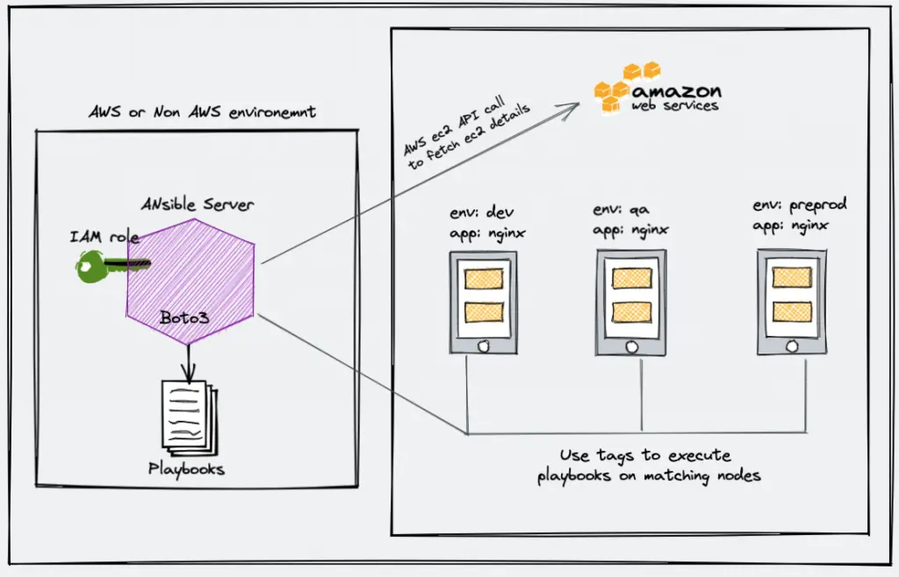

# How to Setup Ansible Dynamic Inventory (AWS)

Ansible with AWS, maintaining the inventory file will be a hectic task as AWS has frequently changed IPs, autoscaling instances, and much more.

Dynamic inventory is an ansible plugin that makes an API call to AWS to get the instance information in the run time. 

It gives you the ec2 instance details dynamically to manage the AWS infrastructure.

Dynamic inventory is not limited to just AWS. It supports most of the public and private cloud platforms. 




## Table of contents

1. Setup Ansible AWS Dynamic Inventory
2. Grouping EC2 Resources With Anisble Dynamic Inventory
3. Execute Ansible Commands With ec2 Dynamic Inventory
4. Using Dynamic Inventory Inside Playbook

Dynamic inventory on AWS using boto and the AWS ec2 Ansible plugin.

Follow the steps carefully for the setup.

## Step 1: 

Ensure that we have python3 & pip3 installed in your Ansible server.

Most Linux operating system comes with phyton3.

CentOS/RHEL 

``` bash
python3 --version
sudo yum install python3 -y
sudo yum –y install python3-pip
```
For Debian, Ubuntu

``` bash
sudo apt-get install python3 -y
sudo apt-get install python3-pip -y
```

## Step 2: 

Install the boto3 library. Ansible uses the boot core to make API calls to AWS to retrieve ec2 instance details.

```bash
sudo pip3 install boto3

if ansible is insalled with pip

sudo apt-get install python-boto3

```

## Step 3: 

Create an inventory directory under /opt and cd into the directory.

 ```bash
sudo mkdir -p /opt/ansible/inventory
cd /opt/ansible/inventory
```


## Step 4: 

Create a file named aws_ec2.yaml in the inventory directory.

aws_ec2.yaml
```yaml
---
plugin: aws_ec2
aws_access_key: <YOUR-AWS-ACCESS-KEY-HERE>
aws_secret_key: <YOUR-AWS-SECRET-KEY-HERE>
keyed_groups:
  - key: tags
    prefix: tag
```

If your ansible server is running inside the AWS environment, attach an ec2 instance role with the required AWS ec2 permissions (Mostly describe instances). 

This way you don’t have to add the access and secret key in the configuration. Ansible will automatically use the attached role to make the AWS API calls.

## Step 5: 
Open /etc/ansible/ansible.cfg file.


```yaml

[inventory]
enable_plugins = aws_ec2
```
## Stpe 6:

Now let’s test the dynamic inventory configuration by listing the ec2 instances.

```bash
ansible-inventory -i /opt/ansible/inventory/aws_ec2.yaml --list
```

The above command returns the list of ec2 instances with all its parameters in JSON format.

If you want to use the dynamic inventory as a default Ansible inventory, edit the /etc/ansible/ansible.cfg file and search for inventory parameters under defaults. 

Change the inventory parameter value as shown below.

inventory      = /opt/ansible/inventory/aws_ec2.yaml

```bash
cat /etc/ansible/ansible.cfg

[inventory]
enable_plugins = aws_ec2
[defaults]
inventory      = /opt/ansible/inventory/aws_ec2.yaml
```

Now if you run the inventory list command without passing the inventory file, Ansible looks for the default location and picks up the aws_ec2.yaml inventory file.

Execute the following command to test if Ansible is able to ping all the machines returned by the dynamic inventory.
```bash
ansible all -m ping
```

## Grouping EC2 Resources With Anisble Dynamic Inventory

The primary use case of AWS Ansible dynamic inventory is to execute Ansible playbooks or ad-hoc commands against a single or group of categorized or grouped instances based on tags, regions, or other ec2 parameters.

You can group instances using tags, instances type, instance names, custom filters, and more. 

Take a look at all supported filters and keyed groups from here.

Here is a minimal configuration for aws_ec2.yaml that uses a few keyed_groups and filters.
```yaml
---
plugin: aws_ec2

aws_access_key: <YOUR-AWS-ACCESS-KEY-HERE>
aws_secret_key: <YOUR-AWS-SECRET-KEY-HERE>

regions:
  - us-west-2

keyed_groups:
  - key: tags
    prefix: tag
  - prefix: instance_type
    key: instance_type
  - key: placement.region
    prefix: aws_region
 ```
 Execute the following command to list the dynamic inventory groups.
 
 ```bash
 ansible-inventory --graph
 ```
 
 You will see an output like the following with all instances grouped under tags, zones, and regions with dynamic group names like 
 aws_region_us_west_2 
 
 instance_type_t2_micro
 
 tag_Name_Ansible
 
 Now you can execute Ansible ad-hoc commands or playbook against these groups.
 
 Let’s test the ec2 dynamic inventory by executing few ansible ad-hoc commands.

### Note: 

Make sure you have the SSH keys or user/password setup in your ansible configuration for Ansible to connect to it for executing the commands.

```bash
ansible aws_region_us_west_2 -m ping
```

## Using Dynamic Inventory Inside Playbook

If you want to use dynamic inventory inside the playbook, you just need to mention the group name in the hosts variable as shown below.

```yaml
---
- name: Ansible Test Playbook
  gather_facts: false
  hosts: aws_region_us_west_2
  tasks:

    - name: Run Shell Command
      command: uptime
  ```
